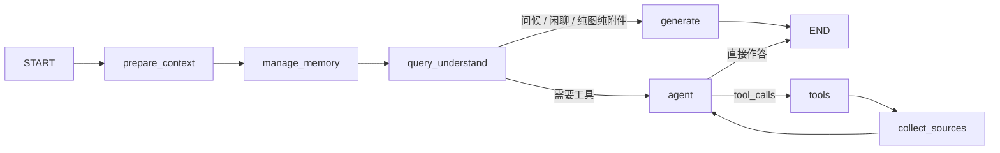

# KnowSphere

面向知识库的 Progressive Agentic RAG。先改写并分流，需要证据时再进入 ReAct 深读。会话原文留在 checkpoint，发给模型的是按稳定性排好的视图，方便前缀缓存命中。

<strong>对话图</strong>

入口是 `agents/graph.py`。一次问答按下面的顺序走：

| 节点 | 做什么 |
|---|---|
| `prepare_context` | 抽出本轮问题和近期问答；清掉上一轮意图、图片描述、引用来源 |
| `manage_memory` | 判断要不要写交接摘要，写入「记住：…」，召回跨会话背景 |
| `query_understand` | 改写检索词并做意图分类，决定进 ReAct 还是直接生成 |
| `agent` | 绑定本轮真正能用的工具，按上下文布局调用主模型 |
| `tools` | 执行工具。大结果先外置或蒸馏，失败最多重试 3 次 |
| `collect_sources` | 只扫当前轮的检索类工具消息，汇总 `[[cN]]` 用的来源 |
| `generate` | 不走工具时的一次生成，例如问候、纯图片说明 |

系统提示在 `prompts/agent_system.py`：事实必须来自检索或联网，命中后要用 `list_chunks` 读全文，不能把上一轮的工具结果当成这轮的证据。

<strong>查询理解</strong>

`agents/nodes/query_understand.py` 产出 `rewrite_query`、`intent`、`image_description`。改写只补指代和省略，不把「最近 / 比较火」这类线索改掉，也不把问题改成「请再检索…」。

意图默认读下一个 token 的 logprobs（`models/decision.py`）。厂商不支持时退回 JSON 结构化输出。有图片时再调一次 VLM 写图片描述。

路由不交给主模型猜：

- `greeting` / `chitchat` / `image_only` / `doc_only` 走 `generate`
- `kb_search` / `clarification` / `summarize` 在已选知识库时进 ReAct
- `web_search` 仅在本轮开了联网时进 ReAct
- 智能体绑了专业工具（如生成 PPT）时，非跳过类意图进 ReAct

这次调用是独立的短请求，不跟主对话共用同一条前缀。

<strong>检索</strong>

`services/retrieval_service.py` 把一次 `doc_retrieval` 做完，图上不拆成向量节点和关键词节点。顺序是：

1. **多库分组。** 每个知识库用自己的 embedding 模型。
2. **混合召回。** 同一条查询打两条 SQL：向量余弦和 `pg_trgm` 词法，再用 RRF 合并。
3. **不够再扩展。** 命中太少时才做 LLM multi-query 或本地同义词扩展，结果继续 RRF。
4. **父块回捞。** 命中子块时取回父段，避免答案落在切块边界上。
5. **精排和多样性。** rerank 之后可选 MMR。

工具层分工：`doc_retrieval` 做语义加词法，`grep_chunks` 做正则锚定，`list_chunks` 按 `cN` 或 `chunk_id` 读全文，`get_document_info` 只看元数据。`query_knowledge_graph` 和 `web_search` / `web_fetch` 是补充，不能代替深读。

<strong>上下文管理</strong>

主对话（`agent` / `generate`）的请求在 `utils/context_layout.py` 里组装。越稳定的内容越靠前，这样身份和技能的前缀可以持续命中缓存。支持显式缓存的厂商在系统级末尾能打断点；其他 OpenAI 兼容接口靠这段字节保持不变。

一次请求从前往后是六段：

1. **系统级。** 身份、能力边界、这个智能体绑定的技能目录。语言和联网开关不写进这段。
2. **任务级。** 接在同一条系统消息后面：是否选了知识库、联网、图谱、回答语言。工具 schema 按这些开关裁剪，调了会失败的工具不放进来。`write_plan`、`generate_pptx`、`get_stored_data` 不依赖这些开关，仍然保留。用户改了开关，只从这里失效。
3. **交接摘要。** 更早对话的压缩，来自 `session_summary`。放在历史上面，不进系统提示，也不写成聊天记录。还没压缩过就空着。
4. **历史。** 只保留最近 `stm_keep_turns` 轮（默认 8）已经结束的对话，按原文送出。checkpoint 里更早的消息还在，只是这次不发给模型。
5. **本轮上下文。** 紧挨最新一条用户消息，不进 checkpoint。只有改写词、图片描述、本轮点名的技能、长期记忆 `asker_background`。同一轮工具循环里这段不再改。
6. **本轮。** 正在进行的问题，以及这一轮新的检索和工具结果，接在最后。

`query_understand`、意图分类、写交接摘要、语义压缩各自请求，不跟这条前缀共用。

<strong>工具结果与对话压缩</strong>

checkpoint 里的原文不改。体积控制发生在写入工具消息时，以及上下文快满时的交接。

**外置。** `utils/tool_result_store.py`。正文超过 8000 字、顶层数组超过 10 条，或工具标记了整份外置时，消息里只留 `{__stored, __refId, __summary, __hint}`。全文进 Postgres `tool_result_refs`。模型需要原文时调用 `get_stored_data`，这个工具不在智能体勾选列表里，返回值不再二次外置。

**语义压缩。** `utils/semantic_compressor.py`。外置前若原文超过 10000 字，先蒸馏到 2000 字以内，只留后续推理要用的 ID、名称、数值和结论。失败则截断并标明是降级结果，不把半截 JSON 当成全文。

**交接。** `utils/conversation_compaction.py`。上一轮 `prompt_tokens` 达到上下文窗口的 85% 时触发，目标压到大约 30%。产物是交接文档，不是一段自由摘要：用户原始请求、分阶段做了什么、放弃的路径、外置结果的引用索引。引用索引由代码从 `__refId` 抽出，不经模型。切分不会从一条工具消息中间下刀。当前这一问不进归档。

<strong>记忆</strong>

会话内和跨会话是两套东西。

**会话内**在 LangGraph checkpoint 里，由 `manage_memory` 在理解问题之前更新。

| 内容 | 放哪 | 作用 |
|---|---|---|
| 全部消息 | checkpoint | 可回放。发给模型时只带最近 N 轮 |
| 交接摘要 | 请求视图里、历史上面 | 覆盖被挤出窗口的更早轮次 |
| 工作记忆 | 只给 `query_understand` | 最近计划和近期问答要点，不进主模型请求 |
| `summary_upto_message_id` | state | 标记已经交接过的位置，避免同一段反复摘要 |

**跨会话**在 Postgres `memory_items` 和文档亲和表，按用户隔离（`utils/long_term_memory.py`）。

- 只有「记住：…」这类明示才会写入，类型是画像、兴趣或事实。
- 回答引用过的文档累计次数，同一文档至少命中 2 次才进入「常查资料」。
- 每轮读出画像、兴趣和常查资料，拼成 `asker_background`，放进本轮上下文，也给查询改写用。它用来消解指代，不当成问题本身。
- 没有后台自动抽取，也没有按需搜索记忆的工具。

<strong>工具与技能</strong>

工具目录在 `tools/catalog.py`。智能体只保存工具名，可执行体不进数据库。本轮没选知识库、没开联网或没开图谱时，对应工具不会出现在 schema 里。

| 类别 | 工具 |
|---|---|
| 规划 | `write_plan` |
| 知识库 | `doc_retrieval`、`grep_chunks`、`list_chunks`、`get_document_info`、`query_knowledge_graph` |
| 联网 | `web_search`、`web_fetch` |
| 生成 | `generate_pptx` |
| 运行时注入 | `read_skill`、`execute_skill_script`、`get_stored_data` |

技能在 `skills/`。系统提示里只放绑定技能的名称、说明和路径。正文要模型先 `read_skill` 再按说明书做。带脚本的技能在 Docker 里执行，输入在 `/workspace/input`，产出在 `/workspace/output`。用户这一轮点名的技能写在本轮上下文里，不改技能目录那段前缀。

<strong>文档摄取</strong>

上传接口把文件放进对象存储并入队。Celery 任务（`api/tasks.py`）再解析、切块、向量化、入库。上传接口和后台任务是两次独立调用，中间不共享一条 trace。

解析器在 `ingestion/parser/`，覆盖常见办公文档、图片和音频。切块在 `chunkers/`，可按标题或父子块。向量按批写入 `stores/` 的 `chunks` 表，维度跟着知识库所选的 embedding 模型走。开启图谱的知识库会再把块送去抽实体关系，写入 Neo4j。

<strong>引用</strong>

检索工具返回带文件名、`chunk_id`、`document_id` 或 URL 的来源。回答里用 `[[cN]]` 紧跟在对应事实上，N 是本轮结果的序号。不要用 `[1]`，也不要在文末堆引用。`collect_sources` 只收集当前轮，上一轮的 `[[cN]]` 不算数。前端用 `ks_citations` 把角标显示成文档名。

<strong>模型</strong>

`models/` 区分本地 Ollama 和远程 OpenAI 兼容接口。远程厂商在 `models/providers.py` 登记，包括硅基流动、OpenAI、阿里云、智谱、DeepSeek、Kimi、火山、混元、千帆、OpenRouter、Jina，以及自定义兼容口。

类型有 `Embedding`、`Rerank`、`KnowledgeQA`、`VLLM`、`ASR`。运行时先用显式模型 ID，否则用该类型的默认模型，再否则用环境变量。API key 用 AES-256-GCM 加密，密钥是 `MASTER_KEY`。内置模型、默认模型、仍被知识库引用的模型不能删除。

<strong>服务与界面</strong>

FastAPI 在 `api/main.py`。会话流式问答、知识库、文档、模型、智能体、技能和评测各自一条路由。对话图跑在 API 进程里，检查点优先用 Postgres，连不上时退回内存。文档处理和评测跑在 Celery。

前端是 `frontend/` 里的 Vue 应用：对话、知识库、智能体、技能、模型和评测。

评测在 `evals/`，覆盖检索、生成和意图分类。意图评测只跑 `query_understand`，不跑整张 ReAct 图。

<strong>可观测性</strong>

配置了 Langfuse 公钥和私钥后才上报，否则全部空操作（`utils/observability.py`）。

一次会话问答是一条 `session_chat` trace。图节点、每次模型调用、每次工具调用会变成子 span，并带上耗时。检索内部的 embedding、两条 SQL、rerank，以及联网时的各次 HTTP，目前还包在对应工具 span 里。工具重试和 Celery 任务重试没有单独的 span。摄取的上传接口和后台解析也是两条互不关联的 trace。

