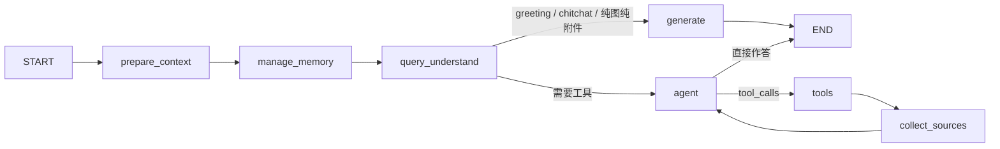

# KnowSphere

Progressive Agentic RAG：先改写分流，再 ReAct 深读；checkpoint 保真，送给模型的是压缩后的视图。

实现入口：`agents/graph.py`、`agents/nodes/`、`services/retrieval_service.py`、`utils/tool_result_store.py` / `semantic_compressor.py` / `conversation_compaction.py` / `short_term_memory.py`。

<strong>1. 对话图：先分流，再 ReAct</strong>

| 节点 | 做什么 |
|---|---|
| `prepare_context` | 抽出本轮 Human、近期问答对；清零上一轮 `intent` / 图片描述 / `last_sources`，避免 checkpoint 脏读 |
| `manage_memory` | 滚动短期窗口、写交接文档、召回跨会话画像（不写进最终回答） |
| `query_understand` | 指代补全 + 意图分类；问候/闲聊走一次 `generate`，其余进 ReAct |
| `agent` | 绑定本轮工具后 think；usage 过高时先做 L3 压缩 |
| `tools` | 执行工具；大结果走 L1 外置 / L2 蒸馏 |
| `collect_sources` | 只扫**当前轮**检索类 ToolMessage，汇总 `last_sources` 供 `[[cN]]` |
| `generate` | 无工具路径的一次生成（问候、纯图说明等） |

系统提示在 `prompts/agent_system.py`：**Evidence-First**，禁止用参数记忆填事实；检索命中后必须 `list_chunks` 深读，不能只靠 snippet。每道新事实题都要重新检索，不能复用历史工具结果当证据。

<strong>2. 查询理解：改写与路由分开</strong>

`query_understand` 产出 JSON：`rewrite_query` / `intent` / `image_description`。改写只做指代消解和省略补全，禁止把「最近 / 比较火」这类线索改没，也禁止把问题改写成「请再检索…」这种元指令。

意图决定走哪条边，而不是让模型自己猜要不要调工具：

- `greeting` / `chitchat` / `image_only` / `doc_only` → 跳过 ReAct
- `kb_search` / `clarification` / `summarize` → 知识库工具（需已选库）
- `web_search` → 仅当输入框开启联网
- 智能体绑了专业工具（如 PPT）时，非跳过类意图一律进 ReAct

未选知识库时运行时意图会归一成 `no_kb`，检索工具不会出现在绑定列表里。

<strong>3. 检索：混合召回后再深读</strong>

`RetrievalService.search` 的固定顺序：

1. **多库分组召回**：每个知识库用自己的 embedding 模型；向量余弦 + `pg_trgm` 词法分加权（`HYBRID_LEX_WEIGHT`）。中文场景不必装分词扩展。
2. **查询扩展**：本地同义词 / 子查询拆分；复杂多跳可再走 LLM multi-query，RRF 融合。
3. **父块回捞**：命中子块时取回父段，避免答案落在切块边界上。
4. **精排 + MMR**：rerank 后再做多样性（`MMR_LAMBDA`；可选叠加 2-gram Jaccard 去词面重复）。
5. **工具层**：`doc_retrieval` 给语义，`grep_chunks` 给正则锚定，`list_chunks` 按 `cN` / `chunk_id` 取全文。图谱与联网都是补充，不能替代深读。

`chunks.owner` 已预留租户过滤，当前固定 `default`。

<strong>4. 上下文工程：L1 / L2 / L3</strong>

对话一长，工具 JSON 会把 context window 吃光。三层管的是「当前轮信噪比」：**checkpoint 里的原文不改**，只压缩送给 LLM 的视图。

L1 工具结果外置（单条体积）

`utils/tool_result_store.py`

- 触发：正文 `>8000` 字，或顶层数组 `>10` 条，或 `ToolSpec.always_store`。
- 消息里只留引用：`{__stored, __refId, __toolType, __originalLength, __summary, __hint}`。
- 全文进 Postgres `tool_result_refs` + 进程缓存。`preview`（原文前 12000 字）只写库，**从不进入 prompt**，也不经 `get_stored_data` 回灌给模型。
- `get_stored_data` 是运行时工具（不在智能体勾选列表），其返回值不再二次外置。
- `collect_sources` 遇到引用会按 `__refId` hydrate，引用角标不丢。

L2 单条语义压缩

`utils/semantic_compressor.py`

- 外置前若原文 `>10000` 字，用 LLM 蒸馏到 ≤2000 字，只保留后续推理需要的 ID、名称、数值、结论。
- 禁止改写 JSON 键、禁止生成 preview（preview 只能是原文 `substring`）。
- 失败则包成 `{__fallbackTruncated, __toolType, __originalLength, content: 原文[:3000]}`，不把半截 JSON 假装成全文。
- L2 外置行带 1h TTL；纯 L1 行不过期。

L3 对话压缩（累积膨胀）

`utils/conversation_compaction.py`。L1/L2 管单条体积，L3 管消息堆起来之后的总量。

- **usage 触发**：`prompt_tokens / contextWindow ≥ 85%`。不用 95%，是因为顶满后模型可能没有输出空间，直接空响应。
- **目标约 30%**：压缩有 LLM + 写回延迟，这段时间新消息还在进窗口；目标太保守会刚结束又触发。
- **产物是交接文档，不是摘要**。固定 schema：
  1. 用户原始请求 — 压缩后不丢目标
  2. 按阶段分组的执行历史：`[阶段] → 做了什么 → 得到什么`；prompt 要求保留具体 ID / 名称 / 数值，禁止「数据已检索」这种空话
  3. 已放弃的路径：`~~方案~~：原因`，避免长对话里重走失败分支
  4. 数据引用索引：从归档消息里**用代码**抽出所有 `__stored.__refId`，不经 LLM；超长时先砍执行历史，请求、放弃路径和 ref 表优先保留
- **切分安全**：不能从 `tool` 消息起刀，向前回溯到发出 `tool_calls` 的 `assistant`。最少保留 6 条、最少删除 2 条。当前轮 Human 不进归档。

agent 在调用主模型前看上一轮 `last_prompt_tokens` 决定是否压缩；调用后再把本轮 usage 写回 state。

<strong>5. 记忆分层：视图压缩，检查点保真</strong>

| 层 | 存活范围 | 作用 |
|---|---|---|
| Checkpoint `messages` | 整段会话 | 完整 Human / AI / Tool，可回放、可引用 hydrate |
| 短期窗口 | 送进 LLM 的最近轮 | 默认保留约 8 轮；历史检索 ToolMessage 在视图里压成一行，避免过期 snippet 冒充新证据 |
| `session_summary` | 被窗口挤出的更早轮 | L3 交接文档，带 `【交接文档】` 标签注入 system |
| 工作记忆 | 本会话 | 最近 `write_plan` + 近期问答要点 |
| 长期记忆 | 跨会话 | 用户说「记住：…」立刻落库；常查资料要同一文档命中 ≥2 次才进入。只注入 `<asker_background>` 辅助改写，不当作问题本身，也不塞进最终回答 |

`summary_upto_message_id` 标记已经交接过的位置，避免同一段归档被反复摘要。

<strong>6. 引用协议</strong>

检索工具返回带 `file_name` / `chunk_id` / `document_id` / URL 的来源。系统提示要求事实后面紧跟 `[[cN]]`（本轮 1-based），禁止 `[1]`、文末堆引用、引用不存在的下标。`collect_sources` 只收集当前轮，历史 `[[cN]]` 作废。前端用 `ks_citations` 把角标还原成文档名。

<strong>7. 模型工厂</strong>

`models/` 区分 `source=local|remote` 与 `parameters.provider`（硅基流动 / OpenAI / 阿里云 / 智谱 / DeepSeek / Kimi / 火山 / 混元 / 千帆 / OpenRouter / Jina / 自定义兼容口）。本地走 Ollama。新远程厂商在 `models/providers.py` 登记即可。

- 类型：`Embedding` / `Rerank` / `KnowledgeQA` / `VLLM` / `ASR`。
- 运行时解析：显式模型 ID → 表内每类型一个 `is_default` → `.env` 兜底；裸模型名直接使用（兼容旧数据）。
- api_key 用 AES-256-GCM 加密（`MASTER_KEY`）；未设置时降级为可逆 base64，仅限开发。
- 删除保护：内置模型、默认模型、被知识库引用的模型不可删除。

